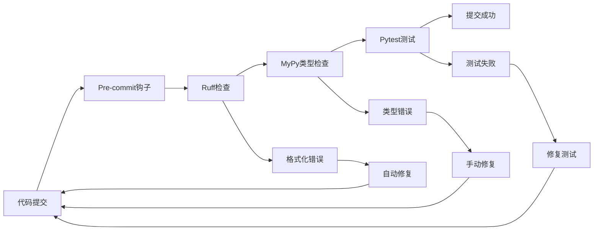

# mindora_sdk 系统概要设计文档

## 1. 项目概述

### 1.1 项目背景
mindora_sdk 是一个面向AI应用的统一基础设施SDK，旨在为5-10人团队提供标准化、可扩展的AI基础设施解决方案。项目解决了从零搭建AI基础设施的复杂性问题，通过统一的Python SDK接口屏蔽底层技术复杂度。

### 1.2 核心价值
- **统一接口**: 提供一致的API访问各种基础设施服务
- **快速部署**: 一键Docker Compose部署完整基础设施栈
- **业务无关**: 纯技术实现，支持任意AI业务场景
- **类型安全**: 基于现代Python技术栈，提供完整类型支持
- **可扩展性**: 支持从单机到分布式的平滑演进

### 1.3 目标用户
- **AI应用开发者**: 使用SDK快速构建AI应用
- **基础设施工程师**: 部署和维护基础设施服务
- **DevOps工程师**: 管理多环境部署和监控

## 2. 系统架构设计

### 2.1 分层架构

```
┌─────────────────────────────────────────┐
│            应用服务层                    │  ← AI应用、业务逻辑
├─────────────────────────────────────────┤
│            SDK适配层                     │  ← mindora_sdk包
│  ┌─────────┬─────────┬─────────┬───────┐ │
│  │ Database│ Storage │ Message │Search │ │
│  │ Client  │ Client  │ Client  │Client │ │
│  └─────────┴─────────┴─────────┴───────┘ │
├─────────────────────────────────────────┤
│           基础设施层                     │  ← Docker服务栈
│  ┌─────────┬─────────┬─────────┬───────┐ │
│  │PostgreSQL│ MinIO  │RabbitMQ │  ES   │ │
│  │  Redis  │ Consul │   RQ    │Qdrant │ │
│  └─────────┴─────────┴─────────┴───────┘ │
├─────────────────────────────────────────┤
│           容器平台层                     │  ← Docker Engine
└─────────────────────────────────────────┘
```

### 2.2 组件关系图

```
MindoraSDK (统一入口)
    ├── DatabaseClient → PostgreSQL + Redis
    ├── StorageClient → MinIO
    ├── MessageClient → RabbitMQ + RQ
    ├── SearchClient → Elasticsearch + Qdrant
    ├── ConfigClient → Consul
    └── MonitoringClient → Prometheus + Grafana
```

### 2.3 数据流图

```
AI应用 → SDK → 客户端 → 基础设施服务
  ↓       ↓      ↓         ↓
配置    类型安全  连接池   实际存储/计算
监控 ← 指标收集 ← 客户端 ← 服务响应
```

## 3. 完整项目目录结构

### 3.1 根目录结构

```
mindora_sdk/
├── README.md                          # 项目主要说明文档
├── CLAUDE.md                          # Claude开发指导文档  
├── pyproject.toml                     # Python项目配置和依赖管理
├── uv.lock                           # UV依赖锁文件
├── justfile                          # 任务自动化工具
├── .gitignore                        # Git忽略文件配置
├── .env.example                      # 环境变量配置模板
│
├── docs/                             # 📖 项目文档
│   ├── README.md                     # 文档索引
│   ├── installation.md               # 安装指南
│   ├── quickstart.md                 # 快速开始
│   ├── api-reference/                # API参考文档
│   ├── examples/                     # 使用示例文档
│   └── deployment.md                 # 部署指南
│
├── ai_memory/                        # 🧠 AI上下文管理目录
│   ├── project/                      # 项目信息
│   │   ├── overview.md               # 项目概要
│   │   ├── system-design.md          # 系统设计文档
│   │   ├── architecture.md           # 详细架构设计
│   │   ├── api-design.md             # API设计规范
│   │   └── deployment.md             # 部署架构
│   ├── features/                     # 功能开发记录
│   │   └── 0001_docker-compose-infrastructure/
│   │       ├── requirements.md       # 需求文档
│   │       ├── design.md             # 设计文档
│   │       ├── plan.md               # 开发计划
│   │       └── issues.md             # 问题记录
│   └── decisions/                    # 架构决策记录(ADR)
│       ├── 0001-technology-stack.md
│       ├── 0002-data-model-design.md
│       └── 0003-infrastructure-services.md
│
├── infrastructure/                   # 🏗️ 基础设施配置
│   ├── docker/                       # Docker相关配置
│   │   ├── docker-compose.dev.yml    # 开发环境
│   │   ├── docker-compose.test.yml   # 测试环境
│   │   ├── docker-compose.prod.yml   # 生产环境
│   │   └── .env.example              # 环境变量模板
│   ├── scripts/                      # 运维脚本
│   │   ├── setup.sh                  # 环境初始化
│   │   ├── backup.sh                 # 数据备份
│   │   ├── restore.sh                # 数据恢复
│   │   ├── health-check.sh           # 健康检查
│   │   └── deploy.sh                 # 部署脚本
│   ├── configs/                      # 服务配置文件
│   │   ├── nginx/                    # Nginx配置
│   │   │   ├── nginx.conf            # 主配置
│   │   │   └── sites/                # 站点配置
│   │   ├── consul/                   # Consul配置
│   │   │   ├── server.json           # 服务器配置
│   │   │   └── services/             # 服务定义
│   │   ├── prometheus/               # Prometheus配置
│   │   │   ├── prometheus.yml        # 主配置
│   │   │   └── rules/                # 告警规则
│   │   └── grafana/                  # Grafana配置
│   │       ├── datasources/          # 数据源配置
│   │       └── dashboards/           # 仪表板配置
│   └── init/                         # 初始化脚本
│       ├── postgres/                 # 数据库初始化
│       │   ├── 01-create-schemas.sql # Schema创建
│       │   └── 02-init-data.sql      # 初始数据
│       ├── consul/                   # Consul配置初始化
│       │   └── kv-init.json          # KV存储初始化
│       └── grafana/                  # Grafana初始化
│           └── dashboards.json       # 仪表板定义
│
├── mindora_sdk/                      # 🎯 核心SDK包 (打包分发)
│   ├── __init__.py                   # 包初始化
│   ├── sdk.py                        # MindoraSDK主类
│   ├── py.typed                      # 类型支持标识
│   ├── core/                         # 核心功能
│   │   ├── __init__.py
│   │   ├── config.py                 # 配置管理
│   │   ├── exceptions.py             # 异常定义
│   │   ├── utils.py                  # 工具函数
│   │   ├── constants.py              # 常量定义
│   │   └── protocols.py              # 接口协议定义
│   ├── clients/                      # 客户端组件
│   │   ├── __init__.py
│   │   ├── base.py                   # 基础客户端类
│   │   ├── factory.py                # 客户端工厂
│   │   ├── database/                 # 数据库客户端
│   │   │   ├── __init__.py
│   │   │   ├── client.py             # DBClient实现
│   │   │   ├── connection.py         # 连接管理
│   │   │   └── migrations.py         # 迁移工具
│   │   ├── storage/                  # 存储客户端
│   │   │   ├── __init__.py
│   │   │   ├── minio_client.py       # MinIO客户端
│   │   │   └── file_manager.py       # 文件管理
│   │   ├── message/                  # 消息队列客户端
│   │   │   ├── __init__.py
│   │   │   ├── rabbitmq_client.py    # RabbitMQ客户端
│   │   │   └── task_manager.py       # 任务管理
│   │   ├── search/                   # 搜索客户端
│   │   │   ├── __init__.py
│   │   │   ├── elasticsearch_client.py # ES客户端
│   │   │   └── qdrant_client.py      # Qdrant客户端
│   │   ├── config/                   # 配置客户端
│   │   │   ├── __init__.py
│   │   │   └── consul_client.py      # Consul客户端
│   │   └── monitoring/               # 监控客户端
│   │       ├── __init__.py
│   │       ├── prometheus_client.py  # Prometheus客户端
│   │       └── logger.py             # 日志客户端
│   ├── models/                       # 数据模型
│   │   ├── __init__.py
│   │   ├── entities/                 # 数据库实体（SQLModel）
│   │   │   ├── __init__.py
│   │   │   ├── base.py               # 基础实体类
│   │   │   ├── user.py               # 用户实体
│   │   │   └── file.py               # 文件实体
│   │   └── schemas/                  # API模式（Pydantic）
│   │       ├── __init__.py
│   │       ├── base.py               # 基础模式类
│   │       ├── user.py               # 用户API模式
│   │       └── file.py               # 文件API模式
│   └── services/                     # 业务服务层
│       ├── __init__.py
│       ├── base.py                   # 基础服务类
│       ├── user_service.py           # 用户服务
│       ├── file_service.py           # 文件服务
│       └── ai_service.py             # AI处理服务
│
├── tests/                            # 🧪 测试代码
│   ├── __init__.py
│   ├── conftest.py                   # 测试配置
│   ├── fixtures/                     # 测试数据固件
│   │   ├── database.py               # 数据库测试数据
│   │   ├── files.py                  # 文件测试数据
│   │   └── configs.py                # 配置测试数据
│   ├── unit/                         # 单元测试
│   │   ├── test_clients/             # 客户端测试
│   │   ├── test_models/              # 模型测试
│   │   └── test_services/            # 服务测试
│   ├── integration/                  # 集成测试
│   │   ├── test_database/            # 数据库集成测试
│   │   ├── test_message_queue/       # 消息队列集成测试
│   │   └── test_search/              # 搜索集成测试
│   └── e2e/                          # 端到端测试
│       └── test_full_workflow.py     # 完整流程测试
│
├── examples/                         # 📚 示例应用
│   ├── quickstart/                   # 快速开始示例
│   │   ├── basic_usage.py            # 基础使用
│   │   ├── async_usage.py            # 异步使用
│   │   └── requirements.txt          # 示例依赖
│   ├── real_world/                   # 真实场景示例
│   │   ├── document_processor/       # 文档处理应用
│   │   │   ├── app.py                # 应用主文件
│   │   │   ├── processors/           # 处理器模块
│   │   │   └── config/               # 配置目录
│   │   ├── user_service/             # 用户服务应用
│   │   └── ai_chat_bot/              # AI聊天机器人
│   └── benchmarks/                   # 性能基准测试
│       ├── throughput_test.py        # 吞吐量测试
│       └── latency_test.py           # 延迟测试
│
└── tools/                            # 🔧 开发工具
    ├── dev_server.py                 # 开发服务器
    ├── migration_tool.py             # 迁移工具
    ├── config_validator.py           # 配置验证工具
    ├── performance_profiler.py       # 性能分析工具
    └── code_generator/               # 代码生成器
        ├── client_generator.py       # 客户端代码生成
        └── model_generator.py        # 模型代码生成
```

### 3.2 目录职责说明

| 目录 | 职责 | 打包分发 | 目标用户 |
|------|------|---------|---------|
| `mindora_sdk/` | 核心SDK包 | ✅ PyPI | 应用开发者 |
| `infrastructure/` | 基础设施配置 | ❌ 独立使用 | 运维工程师 |
| `ai_memory/` | 项目知识库 | ❌ 开发参考 | 维护者 |
| `tests/` | 测试代码 | ❌ 质量保证 | 贡献者 |
| `examples/` | 示例应用 | ❌ 学习参考 | 学习者 |
| `tools/` | 开发工具 | ❌ 开发效率 | 开发者 |
| `docs/` | 项目文档 | ❌ 独立站点 | 所有用户 |

## 4. 技术栈选型

### 4.1 核心技术栈

#### **Python生态系统**
```toml
[project]
requires-python = ">=3.11"
dependencies = [
    "fastapi>=0.104.0",      # 高性能Web框架
    "sqlmodel>=0.0.14",      # 类型安全ORM
    "pydantic>=2.5.0",       # 数据验证
    "httpx>=0.25.0",         # 异步HTTP客户端
    "uvicorn>=0.24.0",       # ASGI服务器
]
```

#### **基础设施服务**
- **PostgreSQL**: 15.x (主数据库，支持JSON)
- **Redis**: 7.x (缓存、会话、队列)
- **MinIO**: RELEASE.2024-01-01T00-00-00Z (对象存储)
- **RabbitMQ**: 3.12-management (消息代理)
- **Elasticsearch**: 8.11.x (全文搜索)
- **Qdrant**: 1.7.x (向量数据库)
- **Consul**: 1.17.x (服务发现、配置)
- **Prometheus**: 2.48.x (监控指标)
- **Grafana**: 10.2.x LTS (监控可视化)

#### **开发工具链**
- **UV**: 包管理器 (快速、现代)
- **Ruff**: 代码检查和格式化
- **MyPy**: 静态类型检查
- **Pytest**: 测试框架
- **Just**: 任务自动化

### 4.2 客户端技术栈

```python
# 各服务客户端依赖
clients_dependencies = {
    "database": ["asyncpg", "sqlmodel", "alembic"],
    "storage": ["minio", "boto3"],
    "message": ["pika", "rq", "celery"],
    "search": ["elasticsearch", "qdrant-client"], 
    "config": ["python-consul"],
    "monitoring": ["prometheus-client"],
}
```

## 5. 开发工具配置

### 5.1 justfile 配置

```just
# justfile - 任务自动化工具

# 默认任务
default:
    @just --list

# 开发环境设置
setup:
    uv sync
    uv run pre-commit install
    just infra-dev

# 代码质量检查
lint:
    uv run ruff check mindora_sdk/
    uv run ruff format mindora_sdk/ --check
    uv run mypy mindora_sdk/

# 代码格式化
format:
    uv run ruff format mindora_sdk/
    uv run ruff check mindora_sdk/ --fix

# 运行测试
test:
    uv run pytest tests/ -v

# 运行测试覆盖率
test-cov:
    uv run pytest tests/ --cov=mindora_sdk --cov-report=html

# 构建包
build:
    uv build

# 发布包
publish:
    uv publish

# 启动开发基础设施
infra-dev:
    cd infrastructure/docker && docker-compose -f docker-compose.dev.yml up -d

# 停止基础设施
infra-down:
    cd infrastructure/docker && docker-compose -f docker-compose.dev.yml down

# 查看基础设施状态
infra-status:
    cd infrastructure/docker && docker-compose -f docker-compose.dev.yml ps

# 基础设施日志
infra-logs:
    cd infrastructure/docker && docker-compose -f docker-compose.dev.yml logs -f

# 数据备份
backup:
    ./infrastructure/scripts/backup.sh

# 健康检查
health:
    ./infrastructure/scripts/health-check.sh

# 清理环境
clean:
    rm -rf dist/
    rm -rf build/
    rm -rf *.egg-info/
    find . -type d -name __pycache__ -exec rm -rf {} +
    find . -type f -name "*.pyc" -delete

# 开发服务器
dev:
    uv run python tools/dev_server.py

# 生成API文档
docs:
    uv run mkdocs serve

# 性能测试
benchmark:
    uv run python examples/benchmarks/throughput_test.py
```

### 5.2 .gitignore 配置

```gitignore
# .gitignore

# Byte-compiled / optimized / DLL files
__pycache__/
*.py[cod]
*$py.class

# C extensions
*.so

# Distribution / packaging
.Python
build/
develop-eggs/
dist/
downloads/
eggs/
.eggs/
lib/
lib64/
parts/
sdist/
var/
wheels/
share/python-wheels/
*.egg-info/
.installed.cfg
*.egg
MANIFEST

# PyInstaller
*.manifest
*.spec

# Installer logs
pip-log.txt
pip-delete-this-directory.txt

# Unit test / coverage reports
htmlcov/
.tox/
.nox/
.coverage
.coverage.*
.cache
nosetests.xml
coverage.xml
*.cover
*.py,cover
.hypothesis/
.pytest_cache/
cover/

# Translations
*.mo
*.pot

# Django stuff:
*.log
local_settings.py
db.sqlite3
db.sqlite3-journal

# Flask stuff:
instance/
.webassets-cache

# Scrapy stuff:
.scrapy

# Sphinx documentation
docs/_build/

# PyBuilder
.pybuilder/
target/

# Jupyter Notebook
.ipynb_checkpoints

# IPython
profile_default/
ipython_config.py

# pyenv
.python-version

# pipenv
Pipfile.lock

# poetry
poetry.lock

# pdm
.pdm.toml

# PEP 582
__pypackages__/

# Celery stuff
celerybeat-schedule
celerybeat.pid

# SageMath parsed files
*.sage.py

# Environments
.env
.venv
env/
venv/
ENV/
env.bak/
venv.bak/

# Spyder project settings
.spyderproject
.spyproject

# Rope project settings
.ropeproject

# mkdocs documentation
/site

# mypy
.mypy_cache/
.dmypy.json
dmypy.json

# Pyre type checker
.pyre/

# pytype static type analyzer
.pytype/

# Cython debug symbols
cython_debug/

# IDEs
.vscode/
.idea/
*.swp
*.swo
*~

# OS
.DS_Store
.DS_Store?
._*
.Spotlight-V100
.Trashes
ehthumbs.db
Thumbs.db

# Docker
.dockerignore

# Infrastructure data
infrastructure/data/
~/.mindora/

# Logs
logs/
*.log

# Temporary files
tmp/
temp/
.tmp/

# UV
uv.lock

# Just
.just/

# Local config overrides
.env.local
docker-compose.override.yml
```

### 5.3 ruff 配置

```toml
# ruff配置 (在pyproject.toml中)
[tool.ruff]
target-version = "py311"
line-length = 88
src = ["mindora_sdk", "tests", "tools"]

[tool.ruff.lint]
select = [
    "E",   # pycodestyle errors
    "W",   # pycodestyle warnings  
    "F",   # pyflakes
    "I",   # isort
    "B",   # flake8-bugbear
    "C4",  # flake8-comprehensions
    "UP",  # pyupgrade
    "ARG", # flake8-unused-arguments
    "SIM", # flake8-simplify
    "TCH", # flake8-type-checking
    "PTH", # flake8-use-pathlib
    "ERA", # eradicate
    "PL",  # pylint
    "RUF", # ruff-specific rules
]
ignore = [
    "E501",   # line too long (handled by formatter)
    "B008",   # do not perform function calls in argument defaults
    "PLR0913", # too many arguments to function call
    "PLR2004", # magic value used in comparison
]

[tool.ruff.lint.per-file-ignores]
"tests/**/*" = ["PLR2004", "S101", "TID252"]
"tools/**/*" = ["T201", "T203"]

[tool.ruff.lint.isort]
known-first-party = ["mindora_sdk"]
force-sort-within-sections = true

[tool.ruff.lint.flake8-type-checking]
strict = true

[tool.ruff.format]
quote-style = "double"
indent-style = "space"
skip-magic-trailing-comma = false
line-ending = "auto"
```

### 5.4 完整 pyproject.toml

```toml
[build-system]
requires = ["hatchling"]
build-backend = "hatchling.build"

[project]
name = "mindora-sdk"
version = "0.1.0"
description = "AI基础设施统一SDK，提供数据库、存储、消息队列等核心服务"
authors = [{name = "Mindora Team", email = "team@mindora.ai"}]
readme = "README.md"
license = {text = "MIT"}
requires-python = ">=3.11"
keywords = ["ai", "infrastructure", "sdk", "fastapi", "docker"]
classifiers = [
    "Development Status :: 3 - Alpha",
    "Intended Audience :: Developers",
    "License :: OSI Approved :: MIT License",
    "Programming Language :: Python :: 3.11",
    "Programming Language :: Python :: 3.12",
    "Framework :: FastAPI",
    "Framework :: Pydantic",
    "Topic :: Software Development :: Libraries :: Python Modules",
    "Topic :: Internet :: WWW/HTTP",
    "Topic :: Database",
]

dependencies = [
    # Web框架
    "fastapi>=0.104.0",
    "uvicorn[standard]>=0.24.0",
    
    # 数据模型和验证
    "sqlmodel>=0.0.14",
    "pydantic>=2.5.0",
    "pydantic-settings>=2.1.0",
    
    # HTTP客户端
    "httpx>=0.25.0",
    
    # 数据库
    "asyncpg>=0.29.0",
    "redis>=5.0.0",
    "alembic>=1.13.0",
    
    # 对象存储
    "minio>=7.2.0",
    "boto3>=1.34.0",
    
    # 搜索
    "elasticsearch>=8.11.0",
    "qdrant-client>=1.7.0",
    
    # 消息队列
    "pika>=1.3.0",
    "rq>=1.15.0",
    "celery[redis]>=5.3.0",
    
    # 服务发现和配置
    "python-consul>=1.1.0",
    
    # 监控
    "prometheus-client>=0.19.0",
    
    # 工具
    "typer>=0.9.0",
    "rich>=13.7.0",
    "structlog>=23.2.0",
]

[project.optional-dependencies]
dev = [
    # 代码质量
    "ruff>=0.1.0",
    "mypy>=1.7.0",
    "pre-commit>=3.5.0",
    
    # 测试
    "pytest>=7.4.0",
    "pytest-asyncio>=0.21.0",
    "pytest-cov>=4.1.0",
    "httpx>=0.25.0",
    "factory-boy>=3.3.0",
    
    # 开发工具
    "ipython>=8.17.0",
    "ipdb>=0.13.0",
]

test = [
    "pytest>=7.4.0",
    "pytest-asyncio>=0.21.0",
    "pytest-cov>=4.1.0",
    "httpx>=0.25.0",
    "factory-boy>=3.3.0",
]

docs = [
    "mkdocs>=1.5.0",
    "mkdocs-material>=9.4.0",
    "mkdocs-mermaid2-plugin>=1.1.0",
]

all = [
    "mindora-sdk[dev,test,docs]",
]

[project.urls]
Homepage = "https://github.com/mindora/mindora-sdk"
Repository = "https://github.com/mindora/mindora-sdk"
Documentation = "https://mindora-sdk.readthedocs.io"
Changelog = "https://github.com/mindora/mindora-sdk/blob/main/CHANGELOG.md"

[project.scripts]
mindora = "mindora_sdk.cli:main"

[tool.hatch.version]
path = "mindora_sdk/__init__.py"

[tool.hatch.build.targets.wheel]
packages = ["mindora_sdk"]

[tool.hatch.build.targets.wheel.hooks.custom]
path = "scripts/build_hook.py"

# Ruff配置
[tool.ruff]
target-version = "py311"
line-length = 88
src = ["mindora_sdk", "tests", "tools"]

[tool.ruff.lint]
select = [
    "E", "W",  # pycodestyle
    "F",       # pyflakes
    "I",       # isort
    "B",       # flake8-bugbear
    "C4",      # flake8-comprehensions
    "UP",      # pyupgrade
    "ARG",     # flake8-unused-arguments
    "SIM",     # flake8-simplify
    "TCH",     # flake8-type-checking
    "PTH",     # flake8-use-pathlib
    "ERA",     # eradicate
    "PL",      # pylint
    "RUF",     # ruff-specific rules
]
ignore = [
    "E501",    # line too long
    "B008",    # function calls in argument defaults
    "PLR0913", # too many arguments
    "PLR2004", # magic value used in comparison
]

[tool.ruff.lint.per-file-ignores]
"tests/**/*" = ["PLR2004", "S101", "TID252"]
"tools/**/*" = ["T201", "T203"]

[tool.ruff.lint.isort]
known-first-party = ["mindora_sdk"]
force-sort-within-sections = true

[tool.ruff.format]
quote-style = "double"
indent-style = "space"

# MyPy配置
[tool.mypy]
python_version = "3.11"
strict = true
warn_return_any = true
warn_unused_configs = true
disallow_untyped_defs = true
disallow_incomplete_defs = true
check_untyped_defs = true
disallow_untyped_decorators = true
no_implicit_optional = true
warn_redundant_casts = true
warn_unused_ignores = true
warn_no_return = true
warn_unreachable = true
strict_equality = true

[[tool.mypy.overrides]]
module = "tests.*"
disallow_untyped_defs = false

[[tool.mypy.overrides]]
module = [
    "minio.*",
    "consul.*",
    "pika.*",
    "rq.*",
    "celery.*",
    "qdrant_client.*",
]
ignore_missing_imports = true

# Pytest配置
[tool.pytest.ini_options]
minversion = "7.0"
addopts = [
    "--strict-markers",
    "--strict-config",
    "--disable-warnings",
]
testpaths = ["tests"]
filterwarnings = [
    "error",
    "ignore::UserWarning",
    "ignore::DeprecationWarning",
]
markers = [
    "slow: marks tests as slow",
    "integration: marks tests as integration tests", 
    "e2e: marks tests as end-to-end tests",
]

# Coverage配置
[tool.coverage.run]
source = ["mindora_sdk"]
branch = true

[tool.coverage.report]
exclude_lines = [
    "pragma: no cover",
    "def __repr__",
    "if self.debug:",
    "if settings.DEBUG",
    "raise AssertionError",
    "raise NotImplementedError",
    "if 0:",
    "if __name__ == .__main__.:",
    "class .*\\bProtocol\\):",
    "@(abc\\.)?abstractmethod",
]
```

## 6. 打包和分发策略

### 6.1 多层次分发模式

```yaml
分发层次:
  PyPI包:
    内容: mindora_sdk/ 核心包
    用户: 应用开发者
    命令: pip install mindora-sdk
    版本: 0.1.0, 0.1.1, 0.2.0, 1.0.0
    
  Docker镜像:
    内容: SDK + Python运行时
    用户: 容器化部署
    命令: docker run mindora/sdk:latest
    标签: latest, 0.1.0, dev
    
  GitHub模板:
    内容: infrastructure/ 完整配置
    用户: 基础设施团队
    使用: "Use this template" 按钮
    更新: 独立的release周期
    
  完整源码:
    内容: 所有目录和工具
    用户: 贡献者和高级用户
    使用: git clone
    包含: 开发环境、测试、文档
```

### 6.2 版本管理策略

```
语义化版本控制 (SemVer):
  Major.Minor.Patch
  
  0.1.0 - 初始版本 (Alpha)
  0.2.0 - 新增客户端功能
  0.3.0 - 完善监控和日志
  1.0.0 - 第一个稳定版本
  1.0.1 - 修复关键bug
  1.1.0 - 新增功能特性
  2.0.0 - 破坏性变更

发布节奏:
  Patch: 每2周 (bug修复)
  Minor: 每1-2月 (新功能)
  Major: 每6-12月 (架构升级)
```

### 6.3 依赖关系图

```
mindora_sdk包 (生产依赖)
├── fastapi (Web框架)
├── sqlmodel (ORM)
├── httpx (HTTP客户端)
├── redis (缓存)
├── minio (对象存储)
├── elasticsearch (搜索)
├── qdrant-client (向量搜索)
├── pika (消息队列)
└── python-consul (配置管理)

开发环境 (完整依赖)
├── mindora_sdk [核心包]
├── infrastructure/ [基础设施]
├── ruff (代码检查)
├── pytest (测试)
├── mypy (类型检查)
└── mkdocs (文档)
```

## 7. 开发流程规范

### 7.1 代码质量保证流程



### 7.2 CI/CD工作流

```yaml
# .github/workflows/ci.yml
name: CI/CD Pipeline

on:
  push:
    branches: [main, develop]
  pull_request:
    branches: [main]

jobs:
  quality:
    runs-on: ubuntu-latest
    steps:
      - uses: actions/checkout@v4
      - uses: actions/setup-python@v4
        with:
          python-version: "3.11"
      - run: pip install uv
      - run: uv sync
      - run: just lint
      - run: just test-cov
      
  build:
    needs: quality
    runs-on: ubuntu-latest
    steps:
      - uses: actions/checkout@v4
      - run: just build
      - uses: actions/upload-artifact@v3
        with:
          name: dist
          path: dist/
          
  publish:
    if: github.event_name == 'push' && github.ref == 'refs/heads/main'
    needs: [quality, build]
    runs-on: ubuntu-latest
    steps:
      - uses: actions/checkout@v4
      - run: just publish
```

## 8. 部署架构设计

### 8.1 Docker Compose多环境配置

```yaml
# 开发环境特点
docker-compose.dev.yml:
  - 暴露所有端口便于调试
  - 启用开发工具和日志
  - 数据持久化到本地目录
  - 资源限制宽松

# 测试环境特点  
docker-compose.test.yml:
  - CI/CD优化配置
  - 最小资源占用
  - 临时数据存储
  - 快速启动和清理

# 生产环境特点
docker-compose.prod.yml:
  - 安全端口配置
  - 资源限制严格
  - 数据备份策略
  - 监控和告警完整
```

### 8.2 数据持久化策略

```bash
# 数据目录结构 (~/.mindora/infrastructure/)
~/.mindora/infrastructure/
├── postgres/          # PostgreSQL数据
├── redis/             # Redis持久化数据
├── minio/             # MinIO对象存储
├── consul/            # Consul数据和配置
├── elasticsearch/     # ES索引数据
├── qdrant/            # 向量数据
├── prometheus/        # 监控数据
├── grafana/           # 仪表板配置
├── rabbitmq/          # 消息队列数据
└── backups/           # 自动备份文件
    ├── daily/         # 每日备份
    ├── weekly/        # 每周备份
    └── monthly/       # 每月备份
```

### 8.3 监控和日志方案

```yaml
监控栈:
  Prometheus:
    - 指标收集和存储
    - 告警规则配置
    - 服务发现集成
    
  Grafana:
    - 可视化仪表板
    - 告警通知
    - 用户权限管理
    
  ELK Stack:
    - Elasticsearch: 日志存储和搜索
    - Kibana: 日志分析界面
    - 日志聚合和分析

关键指标:
  - API响应时间和错误率
  - 数据库连接池状态
  - 消息队列长度
  - 存储空间使用率
  - 系统资源监控
```

## 9. 总结

mindora_sdk项目采用现代化的Python技术栈和容器化架构，提供了完整的AI基础设施解决方案。通过分层设计、模块化架构和统一的SDK接口，实现了业务逻辑与技术实现的有效分离，为AI应用开发提供了坚实的技术基础。

### 9.1 核心优势
- **开发效率**: 统一SDK接口，简化AI应用开发
- **部署简便**: 一键Docker Compose部署完整基础设施
- **类型安全**: 基于现代Python技术栈，提供完整类型支持  
- **可扩展性**: 支持从单机到分布式的平滑演进
- **运维友好**: 完整的监控、日志和备份解决方案

### 9.2 技术特色
- **分层架构**: 清晰的职责分离和依赖关系
- **业务无关**: 纯技术实现，支持任意AI业务场景
- **异步优先**: 全异步架构，支持高并发访问
- **现代工具链**: UV、Ruff、Just等现代开发工具
- **多环境支持**: 开发、测试、生产环境的不同优化

该设计为mindora_sdk项目提供了清晰的技术路线图和实施指南，确保项目能够满足当前需求的同时，为未来的扩展和演进奠定了坚实基础。